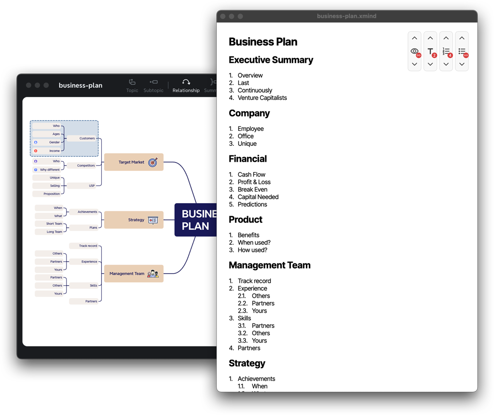
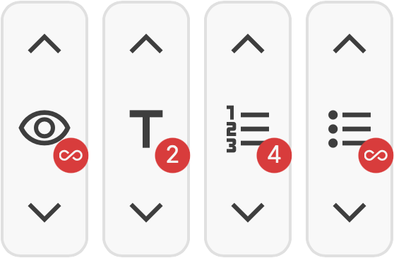

# Xmind live protocol

This application converts a mind map into a protocol document.\
It creates a structured document from an XMind mind map file to be used as abstract or protocol.

Once a mind map is opened, the protocol document will be updated automatically whenever the mind map is changed.



While the preview is rendered from HTML, the internal representation of the mind maps structural data is generated as [Markdown](https://en.wikipedia.org/wiki/Markdown).\
This allows for exporting the protocol document to a broad range of formats, such as plain text, PDF, or DOCX.

## Download

Download the [latest release](https://github.com/davidenke/xmind-live-protocol/releases/latest/) for your platform.\
Other versions can be found on the [releases page](https://github.com/davidenke/xmind-live-protocol/releases/).

> Mac users: Determine the correct version for your macOS platform, either for Intel `*_x64.dmg` or Apple Silicon `*_aarch64.dmg`.

## Usage

> Mac users: Make sure to allow the app to run (system preferences → Security & Privacy → General) once you tried to open it unsuccessfully.

### Open mind maps

Simply run the application and open an XMind mind map file (`*.xmind`) to generate a protocol document.\
Xmind files can either be dragged onto the application window or opened via a file dialog after clicking the window.

To open another mind map, simply close the window with the current protocol document and open up a new one.

### Configure protocol document

#### Tool bar

In the top right corner of the window is a tool bar containing simple stepper buttons to customize the protocol document.\
The tool bar will be hidden when not interacting with it, the cursor is not moved for a while, or the application window is not focused. Just focus the window again and move the cursor to show the tool bar again.



All steppers can be clicked on the upwards or downwards arrow to increase or decrease the value.\
The icon in the middle of the stepper can be clicked to reset the value to its default.\
The badge on the right side of the stepper shows the current value.

Each stepper serves a different purpose:

|         | Visible levels                                               | Headlines                                      | Numbered lists                                                                                   | Bullet lists                                                     |
| ------- | ------------------------------------------------------------ | ---------------------------------------------- | ------------------------------------------------------------------------------------------------ | ---------------------------------------------------------------- |
|         | The number of levels of the mind map that should be visible. | The levels to be shown as headlines.           | The levels to be shown as numbered lists in the protocol document.                               | The levels to be shown as bullet lists in the protocol document. |
| Limits  | At least 1 level must be visible.                            | At maximum 6 levels can be shown as headlines. | No limits for the number of levels, but numbering will be crazy if too many levels are selected. | No limits for the number of levels whatsoever.                   |
| Default | An infinite number of levels is shown.                       | The first 2 levels are shown as headlines.     | Up to the first 4 levels are shown as numbered lists.                                            | All levels above are shown as bullet lists.                      |

---

## Development

### tl;dr

Assuming you have [Rust], [nvm][nvm-nix] and [pnpm] installed, you can run the application with the following commands:

```bash
# install dependencies
nvm use && pnpm i
# start app locally with dev servers
pnpm dev
# start frontend detached
pnpm dev:detached
```

### Prerequisites

To develop and build the application, you have to checkout the sources and install the required tooling.

#### Checkout repository

```bash
git clone https://github.com/davidenke/xmind-live-protocol.git
cd ./xmind-live-protocol
```

#### Setup tooling

The application is built with [Tauri], a framework for building desktop applications with web technologies and a [Rust] backend.

##### macOS

- Xcode Command Line Tools (macOS)
- [Rust] for the backend
- [Version manager][nvm-nix] for [Node.js]
- [pnpm] package manager

```bash
xcode-select --install
curl --proto '=https' --tlsv1.2 https://sh.rustup.rs -sSf | sh
curl -o- https://raw.githubusercontent.com/nvm-sh/nvm/v0.40.1/install.sh | bash
curl -fsSL https://get.pnpm.io/install.sh | sh -
```

##### Windows

1. Rust\
   → https://v1.tauri.app/v1/guides/getting-started/prerequisites/#setting-up-windows
1. [Version manager][nvm-win] for [Node.js]\
   → https://github.com/coreybutler/nvm-windows?tab=readme-ov-file#install-nvm-windows
1. [pnpm] package manager\
   → https://pnpm.io/installation#on-windows

#### Install dependencies

And use correct Node.js version from [`.nvmrc`](./.nvmrc).

```bash
nvm install $(cat .nvmrc)
nvm use $(cat .nvmrc)
pnpm install
```

#### Run development server

To conveniently develop the application, you can start the development server with the following command:

```bash
pnpm dev
```

This will start the frontend using [Vite] and the backend using [Tauri].

#### Build application

To build the application for distribution, you can run the following command:

```bash
pnpm build
```

## Node backend

Conversion of markdown to docx in the browser comes to a cost. We use [@adobe/helix-md2docx](https://www.npmjs.com/package/@adobe/helix-md2docx), which unfortunately uses dependencies importing node modules.\
Thus, we have to mock those modules in our build tooling for usage in a browser context.

As alternative approach, I considered conversion on the backend using a [Node.js] service.\
This could be loaded in [Tauri via Sidecar](https://tauri.app/learn/sidecar-nodejs/). To do so, the Node service must be packed into a single binary file, which can be loaded by the Tauri application.

In the Tauri examples [pkg](https://github.com/vercel/pkg) is used to pack the Node service.\
However, this module is not maintained anymore. But fortunately, this has become a first class citizen in Node.js called [Single Executable Application (SEA)](https://nodejs.org/docs/latest-v20.x/api/single-executable-applications.html#single-executable-application-creation-process). Based on this documentation, I roughly automated this steps with a little [CLI tool](./scripts/prepare-sidecar.ts).\
It can be used calling:

```bash
npx -y tsx ./scripts/prepare-sidecar.ts --from ./src-node/index.ts
```

It still needs to be tested on the CI, as it is unsure if the [requirements](https://github.com/nodejs/postject?tab=readme-ov-file#prerequisites) are fulfilled there. Maybe there already is a GitHub Action for this.

## Icons

Most of the app icons are generated after installation using [the `tauri icon` command](https://v1.tauri.app/v1/guides/features/icons/) (s. `prepare` script in [`package.json`](./package.json)).

### App icon

The only exception is the macOS icon, which is configured to be used from the [`./src/assets/icons/app.icon.icns` path](./src/assets/icons/app.icon.icns) directly. \
This icon is sourced from its Adobe Illustrator file [`./src/assets/icons/app.icns.ai`](./src/assets/icons/app.icns.ai):

- Once opened and edited, the icon has to be exported in [eight different sizes as PNGs](https://gist.github.com/jamieweavis/b4c394607641e1280d447deed5fc85fc) and converted properly.
- To create the files, use the Illustrator export dialog (`File → Export → Export for Screens...`).\
  A preset can be imported from the [`./src/assets/icons/app.icns.preset`](./src/assets/icons/app.icns.preset) file.
- Output the files to the [`./src/assets/icons/icon.iconset`](./src/assets/icons/icon.iconset) folder.
- Then, this _folder is converted_ to an ICNS file _(Yes, you that's right!)_ using the `iconutil` command _on macOS_:\
  `iconutil --convert icns --output src/assets/icons/app.icon.icns src/assets/icons/icon.iconset`.

> As this should not happen very often, this process is not automated but documented here, just as a brief reminder.

[Rust]: https://www.rust-lang.org/
[pnpm]: https://pnpm.io/
[Tauri]: https://tauri.app/
[Vite]: https://vitejs.dev/
[Node.js]: https://nodejs.org/
[nvm-nix]: https://github.com/nvm-sh/nvm
[nvm-win]: https://github.com/coreybutler/nvm-windows
